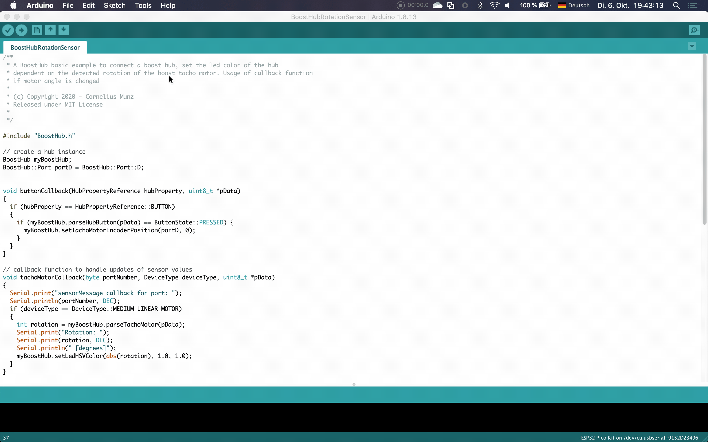
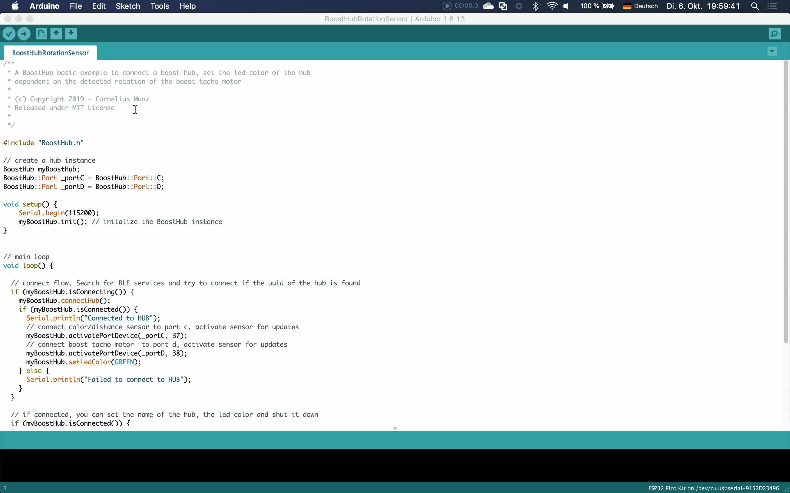
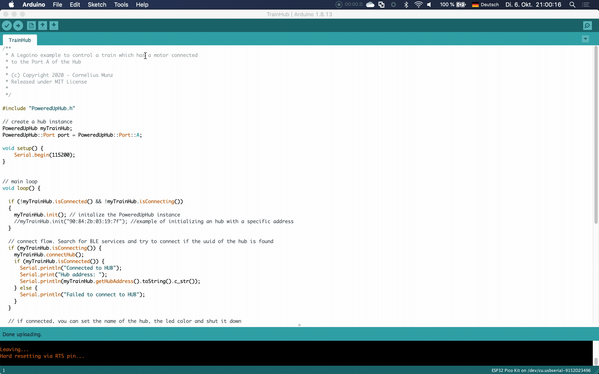

# Legoino Quickstart Tutorial

This is a quickstart step by step tutorial which will guide you to the first legoino project running on your ESP32 board. 

## Step 1: Buy an ESP32 board
To use the library you need an ESP32 microcontroller board which has build in Bluetooth. You can find dozens of suppliers of ESP32 boards. I have the following boards and have had good experiences with it.
* M5 Atom matrix or M5 Atom light (1st choice) [https://m5stack.com/collections/m5-atom/products/atom-matrix-esp32-development-kit](https://m5stack.com/collections/m5-atom/products/atom-matrix-esp32-development-kit)
* Heltec Wifi Kit 32 (2nd choice with build in OLED display) 
[https://heltec.org/project/wifi-kit-32/](https://heltec.org/project/wifi-kit-32/)

## Step 2: Install the Arduino IDE
To develop your application you have to download the Arduino Integrated Development Environment (IDE). Just open the following link and scroll down to the Development Environment section and choose the version which fits to your operating system
[https://www.arduino.cc/en/Main/Software](https://www.arduino.cc/en/Main/Software)
After the download, just install the tool

## Step 4: Install the Legoino Library
To use the Legoino library in the Arduino environment you have to install it with the Arduino Library Manager. You can find it in the Tools Menu. Open the library manager and search for `legoino` Select Install with the latest version. A popup window will appear which shows you the depentend library NimBLE-Arduino. Just select `Install all` to be prepared for you first sketch.

## Step 5: Open Example Sketch
The easiest way to get a project up an running is to open an example provided by the library itself. You can open the examples of installed libraries via the `File` Menu.  In the `Examples` item you can scroll down to `Legoino` and can open the `TrainHub` example. Thats the easiest example with an [LEGO® Powered Up (88009) Hub](https://www.lego.com/product/hub-88009)

After you have opend the sketch, you can press the arrow button on the top left to compile and upload your sketch to the ESP32 board. Before you will do this, select your Board in the Board manager and select the USB (Serial) Port where your board is connected. 

Now your sketch is uploaded to your ESP32 board and the TrainHub Example will run on your device. Now you can open the Serial Monitor to see messages via the USB(Serial) connection. If you press the hub button the device will automatically connect. The Hub LED will switch the color and a connected Motor on Port A will be turn forward and backward.

If you have any problems during the above steps and need support, just use the gitter chat where several Legoino users can provide help

If you have had no problems: :thumbsup: **CONGRATULATION!** :clap: :tada:

## Step 6 Your first own sketch

After you have successfully run the first example you can go one step further and make some adaptions or your own sketch. It ist strongly dependent on what you will do but the following basic building blocks are normally needed

### Decide which Hub you want to connect

### Add a connection procedure

### Motor/Actuator commands (Basic Motor, Tacho Motor, LED, ...)

### Sensor usage (Color, Distance, Tilt, ...)

### Hub value usage (Button, Battery level, ...)
